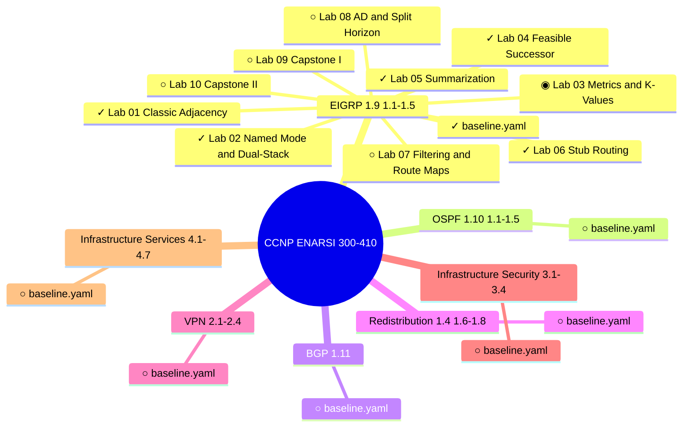

# CCNP ENARSI 300-410 — Lab Progress Map

> Auto-updated after each lab session. Do not edit manually.
> Source of truth: `memory/progress.md`
>
> Legend: `✓` Approved · `◉` Review Needed · `⊙` In Progress · `○` Not Generated

