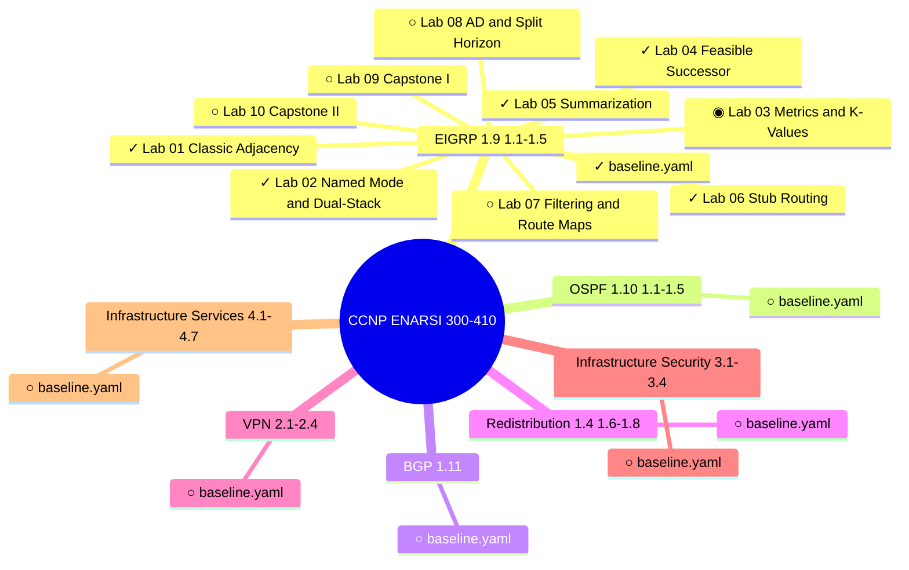

# CCNP ENARSI 300-410 Lab Workbooks

Hands-on lab workbooks for the Cisco **CCNP ENARSI (300-410)** exam — *Implementing Cisco Enterprise Advanced Routing and Services*.

Labs run on **GNS3 with Dynamips** (c7200, IOS 15.3(3)XB12) — fully compatible with Apple Silicon.
Each lab follows the [DeepSeek Standard](docs/README.md): workbook + topology diagram + initial configs + solution configs + fault-injection scripts.

## Chapters

| Chapter | Blueprint Sections |
|---|---|
| EIGRP | 1.9, 1.1–1.5 |
| OSPF | 1.10, 1.1–1.5 |
| BGP | 1.11, 1.1–1.5 |
| Redistribution | 1.4, 1.2, 1.3, 1.6–1.8 |
| VPN | 2.1–2.4 |
| Infrastructure Security | 3.1–3.4 |
| Infrastructure Services | 4.1–4.7 |

## Lab Progress

> Auto-updated after each lab session. Do not edit manually.
> Source of truth: `memory/progress.md`
>
> Legend: `✓` Approved · `◉` Review Needed · `⊙` In Progress · `○` Not Generated

